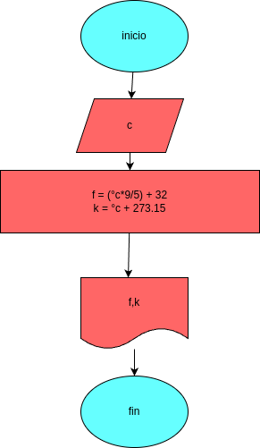

# convertir_en_temperatura
programar en pyton para convertir grados centigrados a grados fahrenheit,kelvil

## Analisis

### Variable de entrada
- c:  temperatura 

### procedimiento
- f= (c*9/5) + 32
- k= C + 273.15

## Diseño

